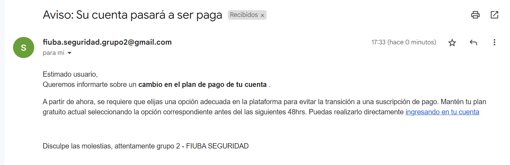

## Vulnerable API - [86.36/66.69] Criptografia y Seguridad Informatica
---
Esta API ha sido creada con propósitos educativos y tiene como objetivo mostrar diversas vulnerabilidades que pueden ser explotadas por terceros interesados en afectarla. Algunos ejemplos de ataques y vulnerabilidades que se presentan incluyen:

| **_Vulnerabilidad_** |**_Nivel_**|
|--------------------|-------------|
| SQL Injection      |GRAVE        |         
| CSRF               |GRAVE        |
| XSS                |GRAVE        |
| CORS               |LEVE         |
| Text Plain Cookie  |GRAVE        |
| MD5                |MEDIO        |


### Integrantes del Trabajo Práctico

* [Alejo Villores](https://github.com/alejovillores) 
* [Ignacio Brusati](https://github.com/brusati)
* [Ignacio Iragui](https://github.com/niragui)
* [Santiago Fernandez](https://github.com/safernandezc)

### Fuentes de documentacion

* SQL Injection
    * [OWASP](https://owasp.org/www-community/attacks/SQL_Injection)
    * [PortSwigger](https://portswigger.net/web-security/sql-injection#:~:text=SQL%20injection%20(SQLi)%20is%20a,not%20normally%20able%20to%20retrieve.)
* CRSF
    * [OWASP](https://owasp.org/www-community/attacks/csrf)
* Cross Site Scripting (XSS)
    * [OWASP](https://owasp.org/www-community/attacks/xss/#:~:text=Cross%2DSite%20Scripting%20(XSS),to%20a%20different%20end%20user.)


## Desarrollo Local

#### Backend

El backend se encuentra desarrollado en el el lenguaje python

Dependencias

| Dependency                   | Version     |
|------------------------------|-------------|
| fastapi                      | 0.95.2      |
| pycparser                    | 2.21        |
| pydantic                     | 1.10.8      |
| requests                     | 2.31.0      |
| uvicorn                      | 0.22.0      |

```shell
python version >= 3.8
# inicializar el servidor backend
python backend/main.py

# terminar servidor backend 
ctrl -C
```
#### Frontend

Este proyecto fue generado con [Angular CLI](https://github.com/angular/angular-cli) version ``15.2.7``.

Ejecute `ng serve` para un servidor de desarrollo. Navegue a `http://localhost:4200/`.La aplicación se recargará automáticamente si cambia alguno de los archivos de origen.

## Desarrollo Docker

### Windows

```bash
docker build -t "insecure-api-rest-backend:latest" backend/Dockerfile
docker run -p 5000:5000 -it --rm --name insecure-api-rest-backend insecure-api-rest-backend:latest
```

```bash
docker build -t "insecure-api-rest-frontend:latest" frontend/Dockerfile
docker run -p 5000:5000 -it --rm --name insecure-api-rest-frontend insecure-api-rest-frontend:latest
Apretar N en el Y/n
```

### Linux
Desde el directorio *backend*
```bash
# inicializar el servidor backend
$ make run-server
```

Desde el directorio *frontend* 
```bash
# inicializar el cliente frontend
$ make run-client
# Cuando pregunta por y/N poner N
```


## Endpoints

#### POST users

```bash
curl --location 'localhost:5000/login' \
--header 'Content-Type: application/json' \
--data '{
    "username":"usuario2",
    "password":"password"
}'
```
####  Vulnerable a injeccion SQL

```bash
curl --location 'localhost:5000/login' \
--header 'Content-Type: application/json' \
--data '{
    "username":"' OR 1=1;-- ",
    "password":"password"
}'
```


```bash
curl --location 'localhost:5000/register' \
--header 'Content-Type: application/json' \
--data '{
    "username":"usuario",
    "password":"password"
}'
```
#### POST reset passwords

```bash
curl --location 'localhost:5000/password/reset?new_password=pass' \
--header 'Cookie: token="usuario?True"'
```
#### POST passwords

```bash
curl --location 'localhost:5000/password' \
--header 'Content-Type: application/json' \
--header 'Cookie: token="usuario?True"' \
--data '{
    "app_username": "usuario",
    "password": "password",
    "app_name": "facebook"
}'
```

#### GET passwords

All passwords
```bash
curl --location 'localhost:5000/passwords' \
--header 'Cookie: token="usuario?True"'
```

Password by ``app_name``
```bash
curl --location 'localhost:5000/password?app_name=fac' \
--header 'Cookie: token="usuario?True"'
```

#### Vulnerable to SQL Injection

Obtener todo las contraseñas de los usuarios
```bash
curl --location 'localhost:5000/password?app_name=%27%20OR%201%3D1%3B%20--' \
--header 'Cookie: token="usuario?True"'
```


#### Email credentials

**email:** fiuba.seguridad.grupo2@gmail.com\
**password:** fiuba1c2023



#### Send fake email for CRFS 
```bash
curl --location --request POST 'localhost:5000/email'
```


